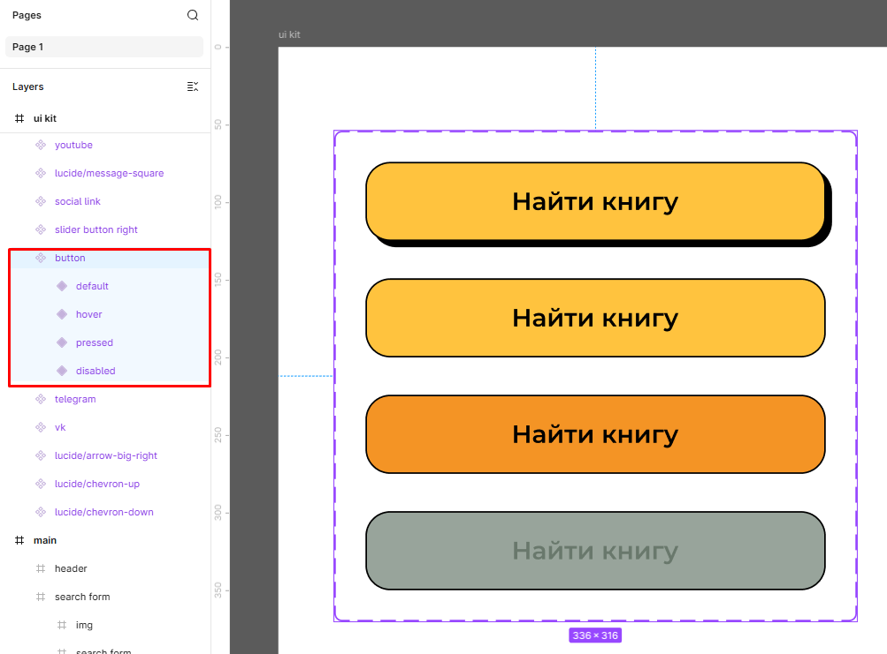
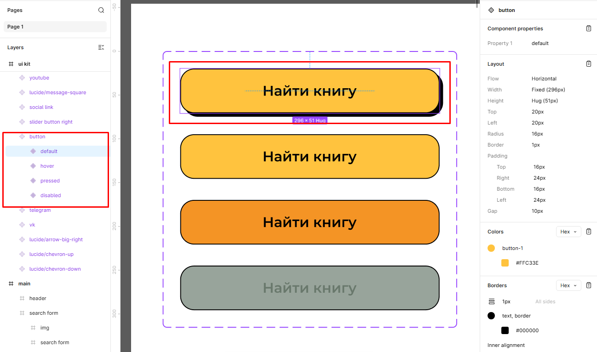
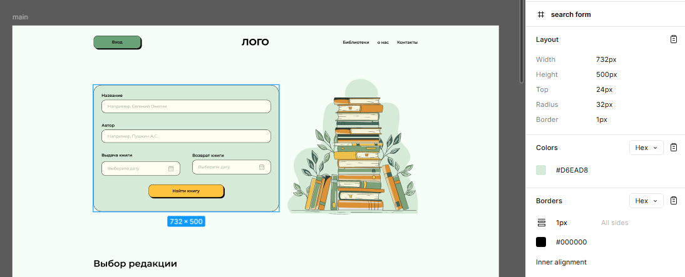
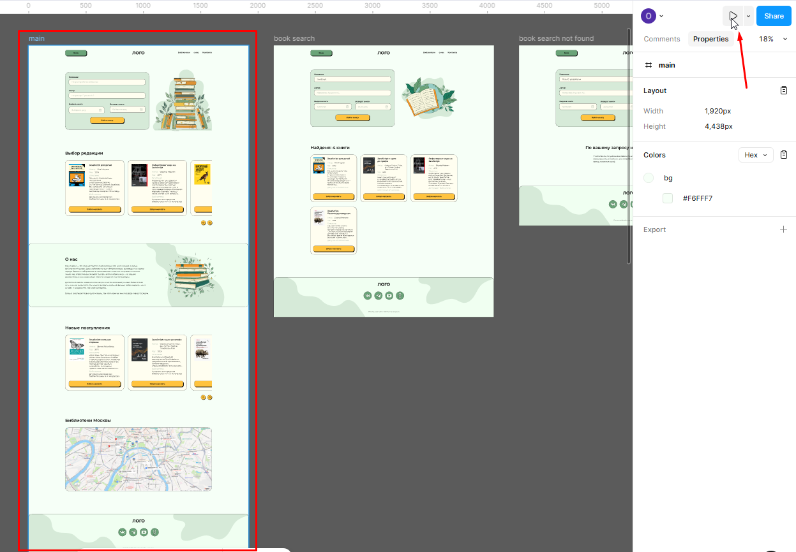
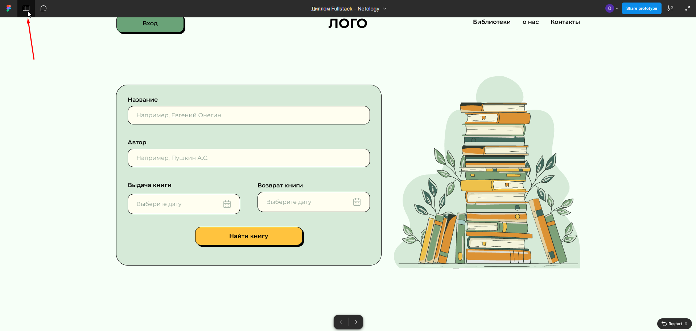
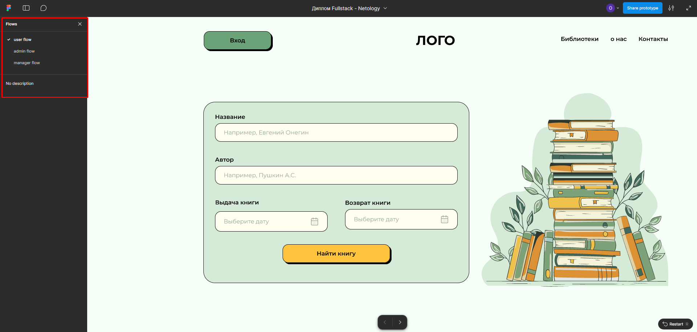

# Работа с макетом (Figma)

### UI Kit

Это специальный фрейм в макете, где собраны все повторяющиеся элементы интерфейса. UI Kit помогает быстро находить нужный компонент, не просматривая весь макет, и видеть, как он выглядит в разных состояниях.

Чтобы посмотреть состояния конкретного элемента (например, кнопки), нажмите на фрейм с этим элементом, в списке слоёв слева откроются все его варианты и состояния.



Если выделить один из вариантов кнопки (или любого другого элемента), то слева в панели слоёв можно увидеть его состояние. А в правой панели отображаются название выбранного состояния и стили этого варианта.



### Стили

В этом макете все основные элементы оформления (цвета, типографика и эффекты) собраны в стили.
Когда вы кликаете по объекту, справа отображаются только его индивидуальные стили.



Если же снять выделение и нажать на пустое место на рабочем поле (холсте), в правой панели откроется полный набор стилей проекта. Все стили подписаны и вы можете использовать их при разработке, перенося значения прямо в свои CSS-переменные в :root. Названия переменных можете оставить такими же, как в макете, или придумать собственные, главное, чтобы система была понятной вам.


### Assets

Все графические элементы, используемые в проекте (иконки, иллюстрации и другие изображения), собраны в папке assets.
Файлы подготовлены в формате SVG, такой формат весит меньше обычных растровых изображений и при этом сохраняет идеальную чёткость при любом масштабе.
Весь набор экспортирован и упакован в архив, чтобы вам было удобно использовать эти файлы.

[Скачать архив](./assets/assets.zip)

### Иконки

В проекте используются иконки из пакета [Lucide](https://lucide.dev/).  
Устанавливаются через npm:

```bash
npm install lucide-react
```

### Интерактивный прототип

В макете реализован интерактивный прототип, который можно запускать прямо в Figma. Он позволяет увидеть поведение интерфейса в реальном времени. 
Чтобы запустить прототип:
1. Выделите главный фрейм Main.
2. В правом верхнем углу нажмите кнопку с треугольником Present — откроется режим просмотра.



Чтобы переключаться между пользовательскими потоками (flows):
- в режиме прототипа нажмите в левом верхнем углу кнопку "Open sidebar",
- в открывшейся панели выберите нужный поток.




